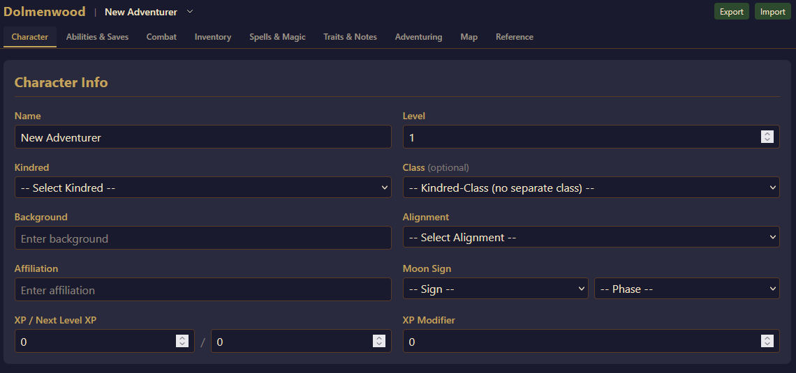

# Dolmen Spot — Dolmenwood Character Sheet

A digital character sheet for the [Dolmenwood](https://necroticgnome.com/collections/dolmenwood) tabletop RPG. Track characters, auto-calculate stats, manage inventory, and reference game data — all in the browser.

**Live app:** [dolmen.stop](https://www.dolmen.spot/)



## Features

### Character Creation & Management
- Support for all 6 kindreds (Breggle, Elf, Grimalkin, Human, Mossling, Woodgrue) and 9 classes (Bard, Cleric, Enchanter, Fighter, Friar, Hunter, Knight, Magician, Thief)
- Kindred-class combinations with dedicated advancement tables
- Multi-character support with import/export (JSON)

### Auto-Calculated Stats
- Armor class, attack bonus, saves, and skills
- XP tracking with level-up thresholds per class
- Dual encumbrance systems (weight-based and slot-based)

### Magic Systems
- Arcane spells (Enchanter, Magician)
- Holy spells (Cleric, Friar)
- Glamours (Elf)
- Fairy runes and mossling knacks

### Inventory
- Full equipment catalog browser
- Container support with nested weight tracking
- Coin management (Copper, Silver, Gold, Pellucidium)

### Adventuring Tools
- 12-month Dolmenwood calendar with moon phases
- Condition and status tracking
- Travel, light source, and camping calculators

### Interactive Hex Map
- Dolmenwood hex map for tracking exploration

### Reference Panels
- Equipment catalog, world lore, consumables, and calendar reference
- Class and kindred feature panels with interactive mechanics (fighter talents, grimalkin forms, etc.)

## Tech Stack

- [Next.js](https://nextjs.org/) 15
- [React](https://react.dev/) 19
- [TypeScript](https://www.typescriptlang.org/)
- [Tailwind CSS](https://tailwindcss.com/) v4
- [Lucide React](https://lucide.dev/) icons
- localStorage for persistence (no backend required)

## Getting Started

```bash
git clone https://github.com/TheBeege/dolmen-spot.git
cd dolmen-spot
npm install
npm run dev
```

Open [http://localhost:3000](http://localhost:3000) in your browser.

## Project Structure

```
src/
  app/          # Next.js app router (page, layout, global styles)
  components/   # Tab components (CharacterInfo, CombatStats, Inventory, etc.)
  hooks/        # useCharacter hook (state management + localStorage)
  lib/          # Types, game data, and utilities
docs/
  rules/        # Extracted rule reference documents
```

## Disclaimer

Dolmenwood is a trademark of [Necrotic Gnome](https://necroticgnome.com/). This is an unofficial fan project and is not affiliated with or endorsed by Necrotic Gnome. Game content is used for personal/fan use only.

The source code for this application is licensed under the [MIT License](LICENSE).
